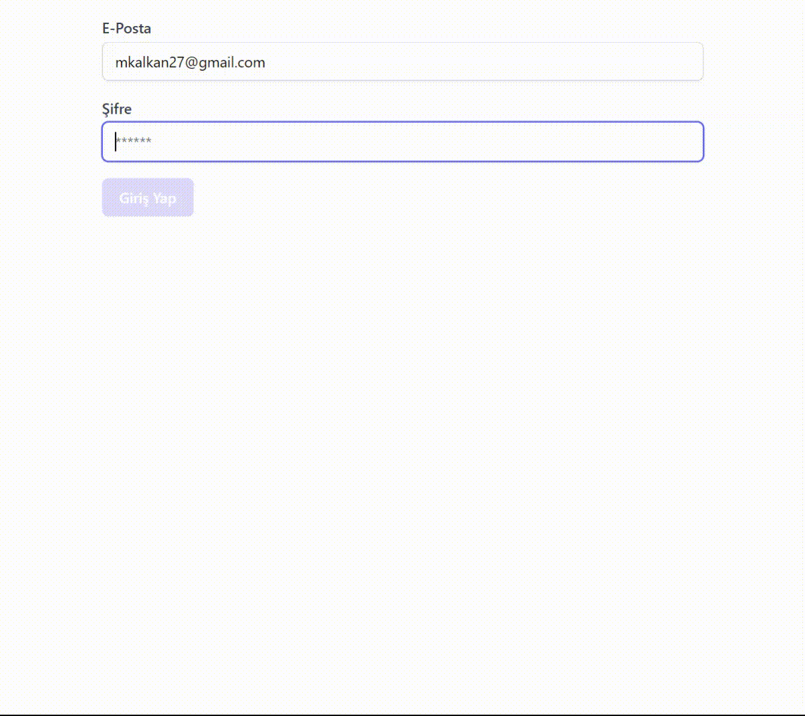

# React & Firebase Authentication Uygulaması

-Bu uygulamada Firebase in   

  getAuth,
  createUserWithEmailAndPassword,
  sendEmailVerification,
  updateProfile, updatePassword, 
  onAuthStateChanged,
  signInWithEmailAndPassword,
  signOut

  özellikleri kullanılmıştır.
  
-Uygulama ile Firebase in email ile kayıt olma, oturum açma ve profl bilgileri güncelleme özellikleri üzerinde durulmuştur.

-Home sayfasında kullanıcı bilgileri, email doğrulama ve çıkış yapma butonu bulunmaktadır. Ayrıca bu sayfada profil bilgileri güncelleme bileşeni bulunmaktadır.

-Login sayfası ile giriş yapılıp oturum açılmaktadır.

-Register ile kayıt işlemi yapılmaktadır.

# Uygulamda kullanılan kütüphaneler

   "@reduxjs/toolkit": "^2.2.5",
    "@tailwindcss/forms": "^0.5.7",
    "@testing-library/jest-dom": "^5.17.0",
    "@testing-library/react": "^13.4.0",
    "@testing-library/user-event": "^13.5.0",
    "firebase": "^10.12.2",
    "react": "^18.3.1",
    "react-dom": "^18.3.1",
    "react-hot-toast": "^2.4.1",
    "react-redux": "^9.1.2",
    "react-router-dom": "^6.23.1",
    "react-scripts": "5.0.1",
    "web-vitals": "^2.1.4"

# FirebaseAuth
